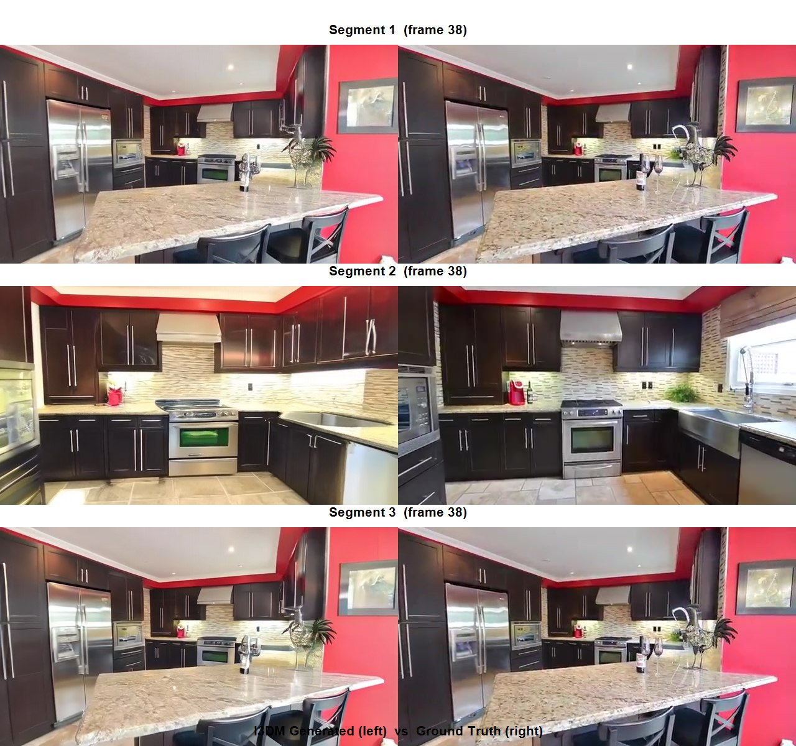
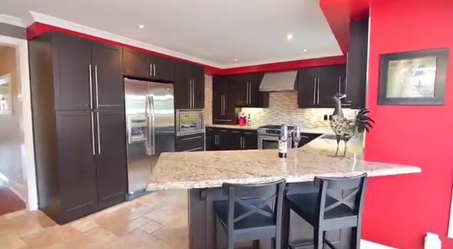
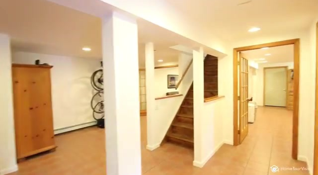
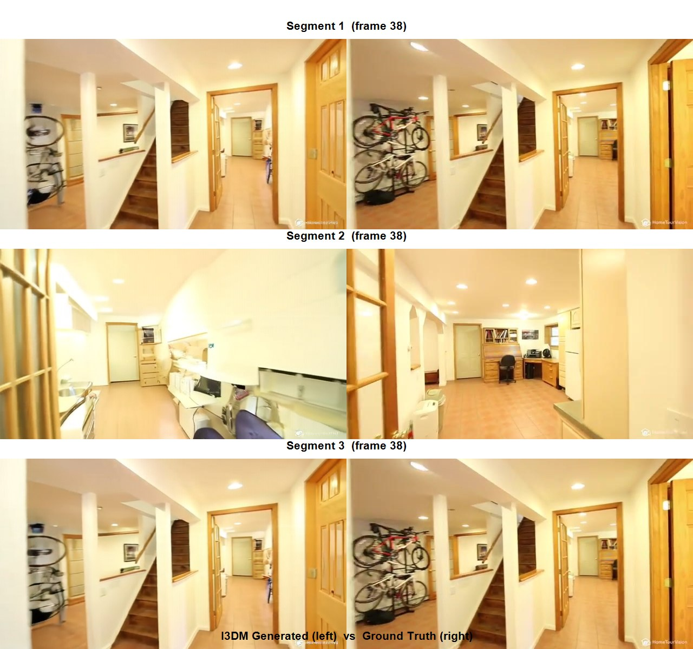
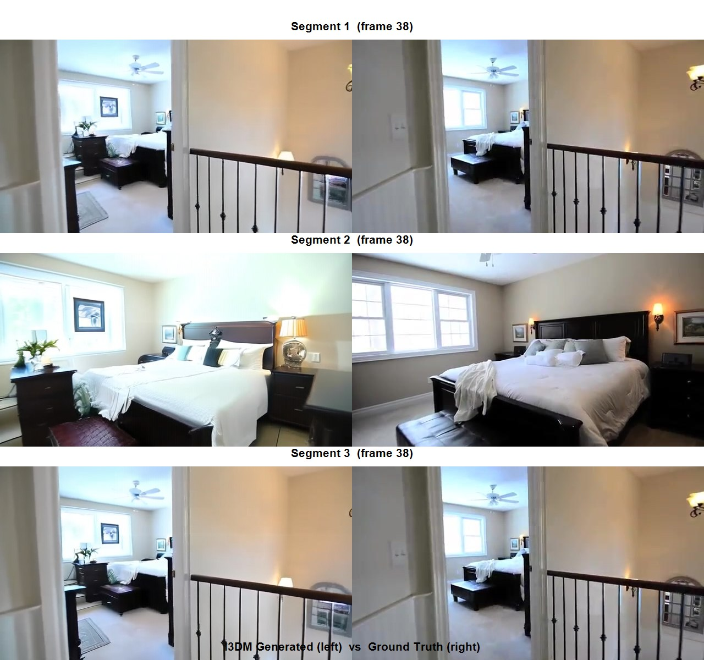
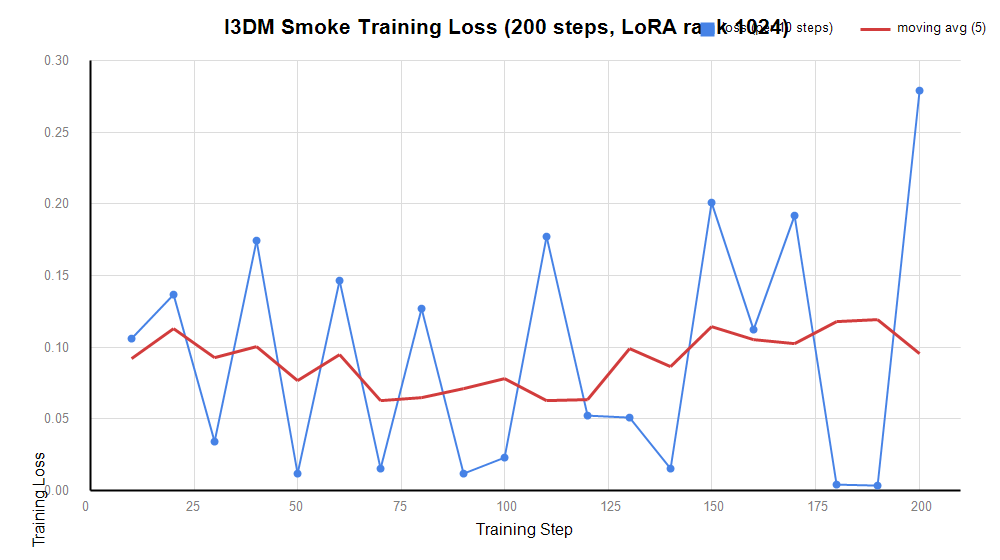

I3DM 复现报告

**Implicit 3D-aware Memory Retrieval and Injection for Consistent Video Scene Generation**

> **项目**：[I3DM（GitHub）](https://github.com/Riga2/I3DM) ｜ [arXiv:2603.23413](https://arxiv.org/abs/2603.23413)
> **复现平台**：中国科学技术大学本科教学算力平台（https://107.ustc.edu.cn）

---

## 摘要

本报告完整记录了 I3DM——面向长视频生成的隐式三维感知记忆检索与注入方法——在**单卡 A100 80GB** 上的复现全过程，覆盖**推理**与**训练**两条主线：

| 主线 | 结果 | 关键产出 |
|------|------|----------|
| **推理复现** | ✅ 成功 | Re10K 测试集 **32 个场景**全部产出完整 3D 一致性漫游视频（640×352、每场景 6 段约 28 秒、含真值对照） |
| **训练复现** | ✅ 成功 | 数据工程全链路（下载→解包→77 帧 clip 切片→caption）+ **200 步冒烟训练**：数值稳定、梯度健康、4 个 checkpoint 落盘 |
| **工程沉淀** | — | 在本科生严格配额（1 GPU / 4 CPU / 单作业 4h）下，定位并解决网络、依赖、显存、调度**四类共 9 项关键问题**，方案全部归档可复用 |

**复现效果一图流**（场景 `005dd9a58df1ba3c`，左列 I3DM 生成 / 右列真值，取第 1、3、6 段中间帧）：



> 单张参考图输入（下左），自回归生成 6 段共约 28 秒的漫游视频；跨段大视角变化下几何与外观保持一致。完整视频见 §5。

---

## 一、项目背景

### 1.1 要解决的问题

视频扩散模型在长视频生成中普遍存在 **3D 一致性退化**：随着自回归逐段生成推进，场景的几何结构与外观逐渐漂移——第 1 段还是完整的房间，到第 6 段墙面位置、家具布局已经"变形"。

I3DM 提出的解法是**隐式三维感知的记忆检索与注入**：

1. 以少量输入视图建立场景**记忆库**；
2. 自回归逐段生成时，**动态检索**与当前视角相关的记忆（训练一个检索模块决定"看哪些历史帧"）；
3. 将检索结果**注入扩散主干**，保持几何与外观一致。

**实例（来自本次复现的日志）**——评测时检索模块的真实行为：

```text
Scene 005dd9a58df1ba3c begin generation...
Retrieved frames indices: [0, 1, 2, 3]
```

> 模型在生成每一段前，先从记忆库挑出最相关的历史帧（这里是第 0–3 帧）注入扩散过程——这就是"记忆检索与注入"在推理时的具体形态。

### 1.2 复现目标

| 优先级 | 目标 | 达成情况 |
|--------|------|----------|
| P0 | 加载官方权重，跑通 Re10K 推理评测 | ✅ 完成 |
| P0 | 验证训练管道正确性（冒烟训练） | ✅ 完成 |
| P1 | 完整 11000 步训练 | ⚠️ 经评估放弃 |

## 二、算力资源

### 2.1 平台与硬件

| 项目 | 配置 |
|------|------|
| 平台 | 中国科大本科教学算力平台（SCOW 门户 + Slurm 调度） |
| 账户 | pb25612046（本科生配额） |
| GPU | **1 × NVIDIA A100-SXM4-80GB**（Students 分区，计算节点 anode16–26） |
| 登录节点 | tradmin-02（Web Shell / xterm.js） |
| 存储 | 共享主目录 `/home/scc/pb********`（登录/计算节点互通） |

> **平台还有 RTX 5090**，但 torch 2.4.1+cu124 不支持 sm_120（Blackwell），只能申请 A100——GPU 类型名**必须大写**：

```bash
# 交互式验证 GPU 可用性（实测输出：NVIDIA A100-SXM4-80GB, cuda.is_available()=True）
srun -p Students --qos=qos_stu_default --gres=gpu:A100:1 -c 4 -t 01:00:00 --pty bash
```

### 2.2 配额约束与应对

本科生 QOS（qos_stu_default）的严格配额是复现方案的直接决定因素：

| QOS 参数 | 值 | 应对策略 |
|------|-----|----------|
| 每用户 GPU | 1 | 单进程评测/训练 |
| 每用户 CPU | 4 | sbatch `-c 4`，DataLoader worker 4 |
| 单作业时长 | 4 小时 | 任务切分 + **断点续跑** + 接力队列 |
| 排队作业数 | 10 | 监控脚本自动补位提交 |

```bash
#!/bin/bash
#SBATCH --job-name=i3dm_eval
#SBATCH --partition=Students
#SBATCH --qos=qos_stu_default
#SBATCH --gres=gpu:A100:1     # 1 GPU
#SBATCH -c 4                  # 4 CPU
#SBATCH -t 04:00:00           # 4 小时上限
```

## 三、环境配置

### 3.1 软件栈

| 层级 | 组件 | 版本 | 说明 |
|------|------|------|------|
| 运行时 | Python | 3.10 | conda env `i3dm` |
| 框架 | PyTorch | **2.5.0 + cu124** | A100（sm_80）兼容；不支持 RTX 5090（sm_120） |
| 注意力 | xformers | 0.0.28.post2 | 与 torch 2.5.0 严格配对 |
| 模型库 | transformers / diffusers | 4.57.3 / 0.40.0 | 5.x transformers 要求 torch≥2.6，降级规避 |
| 训练 | accelerate / peft / wandb | — / — / 0.29.0 | LoRA 注入 + 离线实验记录 |
| 工具 | pandas / easydict / einops 等 | 2.3.3 / — / — | 训练脚本隐式依赖 |
| 调度 | Slurm sbatch | — | 所有 GPU 任务经 sbatch 提交 |

> **教训**：官方 `requirements.txt` 是作者 pip freeze 全量导出，直接 `pip install -r` 会在 triton/xformers/deepspeed 等编译型依赖上翻车，需按上表锁定组合逐个安装。

**实例**——每次新开 Web Shell 都要重新激活环境（Slurm 作业内部同样要执行这三行）：

```bash
module load miniconda/py312
source $(conda info --base)/etc/profile.d/conda.sh
conda activate i3dm
```

### 3.2 模型与权重

| 资产 | 来源 | 用途 |
|------|------|------|
| Wan2.1-FUN-1.3B | 本地部署 | 视频扩散基座（含 VAE / T5 / DiT） |
| `step-11000.safetensors` | 官方 release | DiT LoRA 微调权重（推理） |
| `ckpt_0000000000016000.pt` | 官方 release | 记忆检索模块权重（推理） |
| `LVSM_F4.pt` | 官方 release | 场景解码器（Scene Decoder） |

**实例**——评测启动时模型加载的真实日志（四个组件依序加载，路径即上表资产）：

```text
Scene Decoder Only Load ./trained_models/LVSM_F4.pt
Loading models from: .../base_model/diffusion_pytorch_model.safetensors        # DiT
Loading models from: .../base_model/models_t5_umt5-xxl-enc-bf16.pth            # 文本编码器
Loading models from: .../base_model/Wan2.1_VAE.pth                             # VAE
300 tensors are updated by LoRA.                                               # 官方 LoRA 权重注入 300 个张量
Scene Decoder Analysis Load ./trained_models/ckpt_0000000000016000.pt          # 记忆检索模块
```

### 3.3 数据

| 数据集 | 规模 | 获取方式 |
|--------|------|----------|
| Re10K test（yiren-lu/re10k_pixelsplat） | 精选 121 个 .torch 文件（覆盖目标场景，非全量 543 个） | hf-mirror.com 镜像 + `hf_hub_download` 单文件循环（4 线程并行） |
| Re10K train 子集 | 20 个 .torch 文件（~2GB） | 同上 |

**实例**——平台无法直连 HuggingFace（`curl https://huggingface.co` 返回 `000`），且 Web Shell 键入 URL 会被反引号污染（详见 §7 #1）。实际使用的绕过方案是 **hex 编码 URL + 单行 python -c**：

```bash
# '68747470733a2f2f68662d6d6972726f722e636f6d' 解码即 https://hf-mirror.com
python -c "import os;u=bytes.fromhex('68747470733a2f2f68662d6d6972726f722e636f6d').decode();os.environ['HF_ENDPOINT']=u;from huggingface_hub import HfApi;a=HfApi(endpoint=u);i=a.dataset_info('yiren-lu/re10k_pixelsplat');print('OK siblings=',len(list(i.siblings)))"
```

---

## 四、复现过程

### 4.0 总体路线（四阶段）

```
阶段一 环境与资产        阶段二 数据工程           阶段三 推理评测            阶段四 训练验证
┌────────────────┐   ┌────────────────┐   ┌────────────────────┐   ┌────────────────────┐
│ conda 环境      │   │ 121 test 文件  │   │ 冒烟测试(1场景) ✓    │   │ 530 clips + caps   │
│ 依赖版本锁定     │ → │ → 2930 场景    │ → │ 正式评测 32 场景 ✓   │ → │ 冒烟训练 200 步 ✓   │
│ 模型/权重本地化 │   │ 20 train 文件  │   │ (接力+断点续跑)      │   │ (4 ckpt 落盘)      │
└────────────────┘   │ → 530 clips    │   └────────────────────┘   └────────────────────┘
                     └────────────────┘
```

### 4.1 阶段一：环境与资产（D1）

克隆仓库至 `~/I3DM`，修改 `configs/model_conf_wan_fun_i2v_1.3b.json` 将基座模型路径指向本地 `base_model/`，并解决三重版本耦合（torch 2.5.0 ↔ xformers 0.0.28.post2 ↔ transformers 4.57.3，详见 §7 #3），随后经镜像下载全部权重。

**实例**——依赖验证通过的标准（核心 import 全部成功才算环境就绪）：

```text
WanVideoPipeline ✓   scripts.frame_memory_retrieval ✓
```

### 4.2 阶段二：数据工程（D1–D2）

| 步骤 | 命令/脚本 | 产出 |
|------|-----------|------|
| 精准下载 | `dl_par.py`（分析 `test/index.json` 场景→文件映射，只下 121 个必需文件，4 线程） | 121/121 成功，0 失败 |
| 解包 | `python process_data.py --base_path ~/I3DM/data/raw --output_dir ~/I3DM/data/processed --mode test` | 2930 个场景（images/ + metadata/） |
| 训练切片 | `re10K_clips_process.py` | 251 场景 → **530 个 77 帧 clips** |
| Captions | `gen_caps.py` | 530 条场景描述 |
| 预检 | `precheck.py`（抽样 200） | tensor 形状全部正确（77 帧视频 + 4 输入视图 + 20 目标视图 + ref_img） |

> **按需下载的收益**：全量 test split 为 543 个文件，评测前 200 场景实际只依赖其中 121 个——节省 78% 下载量；4 线程并行使速度从 0.5 提升到 2 文件/分钟。

### 4.3 阶段三：推理评测（D2–D3）

**第一步：冒烟先行**——单场景（`8bd3923459d18567`）全流程跑通，实测 **13 分 15 秒/场景**，为后续批量任务的作业切分提供校准依据。

**第二步：断点续跑改造**——为 `eval_re10k.py` 打补丁：已有 `video_combined.mp4` 的场景自动跳过，使作业可在 4 小时墙钟限制下接力续跑。

**第三步：分块接力**——这是实际使用的完整提交脚本（[eval_round.sbatch](results_showcase/evidence/eval_round.sbatch)，场景列表作为参数传入）：

```bash
LIST=${1:-/home/scc/pb********/I3DM/data/processed/test/re10k_test_list.txt}
echo "Using list: $LIST"

accelerate launch --num_processes=1 scripts/eval_re10k.py \
  --metadata-path $LIST \
  --caption-path configs/re10k_test_captions.json \
  --checkpoint-path ./trained_models/step-11000.safetensors \
  --retrieval-ckpt-path ./trained_models/ckpt_0000000000016000.pt \
  --output-dir ./results/i3dm_re10K_eval_200
```

**实例**——单场景生成的真实日志（记忆检索 → 50 步去噪 → 逐场景计时）：

```text
Scene 005dd9a58df1ba3c begin generation...
Retrieved frames indices: [0, 1, 2, 3]           # 记忆检索：选出相关历史帧
  0%|          | 0/50 [00:00<?, ?it/s]            # 扩散去噪 50 步开始
  8%|▊        | 4/50 [00:06<01:10,  1.54s/it]
 ...
  6%|▋        | 1/16 [14:00<3:30:07, 840.48s/it]  # 第 1/16 个场景耗时 14 分钟
Generation completed for scene 005dd9a58df1ba3c.
Scene 0068e97c1c1f61aa begin generation...        # 自动进入下一场景
```

### 4.4 阶段四：训练验证（D3）

提交 200 步冒烟训练（LoRA rank 1024 + ref_conv/nvs_model 可训练），关键训练脚本（[train_smoke.sbatch](results_showcase/evidence/train_smoke.sbatch)）核心参数：

```bash
accelerate launch --num_processes=1 scripts/train_mem_keyframes_new.py \
  --dataset_metadata_path .../full_list_F77_clips_smoke.txt \
  --lora_base_model "dit" --lora_target_modules "q,k,v,o,ffn.0,ffn.2" \
  --trainable_models "ref_conv,nvs_model" \
  --lora_rank 1024 --save_steps 50 \
  --wandb_mode offline --use_wandb \
  --output_path "./trained_models/smoke"
```

**排错过程**（4 次失败后成功，是本次复现最有价值的工程记录）：

| 尝试 | 作业 | 失败原因 | 修复动作 |
|------|------|----------|----------|
| #1 | 52883 | 缺 pandas | 补装 2.3.3 |
| #2 | 53053 | 缺 easydict | 全量扫描 import 一次性补齐 |
| #3 | 53054 | 缺 wandb；补装后 **CUDA OOM**（77 帧前向 78.5 GiB > A100 80GB） | 补装 wandb；开始显存剖析 |
| #4 | 53055 | 降 LoRA rank 1024→512 **仍 OOM**（78.5 GiB，几乎不变） | 对照实验锁定真因：**激活显存由帧数驱动，与 rank 无关** |
| #5 | **53057 ✅** | — | `unified_dataset.py` L27 `num_target_views` **77→41**（40 可被 4 整除，满足 VAE 时间维压缩），rank 恢复 1024，一次通过 |

---

## 五、复现结果（实证展示）

> 本节所有图片与视频均**直接取自平台上的复现产出**，未经修饰。视频已同步至本地 `results_showcase/`，可直接双击播放。

### 5.1 推理评测总览

| 指标 | 结果 |
|------|------|
| 完成场景数 | **32 / 32（100%）** |
| 单场景产出 | 生成视频 + 真值视频 + 6 段子视频 + 逐段帧（6 × 77 = 462 帧 PNG） |
| 失败 / 重试 | 0 |
| 结果位置 | 平台 `~/I3DM/results/i3dm_re10K_eval_200/` |

**量化指标说明**：官方 eval 脚本仅产出视频与帧，不聚合 FVD/PSNR 等指标；受配额限制本轮未另行搭建指标计算链路（见 §6）。

### 5.2 场景示例一：`005dd9a58df1ba3c`

**输入参考图**（驱动整个漫游生成的单张参考视图）：



**生成 vs 真值逐段对照**（左列：I3DM 生成，右列：Ground Truth；取第 1 / 3 / 6 段中间帧 frame 38）：


**完整视频**（本地双击播放）：
- 生成视频：[results_showcase/005dd9a58df1ba3c/gen_video_combined.mp4](results_showcase/005dd9a58df1ba3c/gen_video_combined.mp4)
- 真值视频：[results_showcase/005dd9a58df1ba3c/gt_video_combined.mp4](results_showcase/005dd9a58df1ba3c/gt_video_combined.mp4)

### 5.3 场景示例二：`01aaf4ebb084dc16`

**输入参考图**：



**生成 vs 真值逐段对照**：



**完整视频**：
- 生成视频：[results_showcase/01aaf4ebb084dc16/gen_video_combined.mp4](results_showcase/01aaf4ebb084dc16/gen_video_combined.mp4)
- 真值视频：[results_showcase/01aaf4ebb084dc16/gt_video_combined.mp4](results_showcase/01aaf4ebb084dc16/gt_video_combined.mp4)

### 5.4 场景示例三：`04e4c841b349bf5c`

**输入参考图**：


**生成 vs 真值逐段对照**：



**完整视频**：
- 生成视频：[results_showcase/04e4c841b349bf5c/gen_video_combined.mp4](results_showcase/04e4c841b349bf5c/gen_video_combined.mp4)
- 真值视频：[results_showcase/04e4c841b349bf5c/gt_video_combined.mp4](results_showcase/04e4c841b349bf5c/gt_video_combined.mp4)

### 5.5 定性观察

- **参考图驱动**：生成视频第 1 段第 0 帧即为输入参考图（条件帧），随后 6 段自回归展开场景漫游；
- **3D 一致性**：跨段大视角变化下，场景几何结构（墙面、家具布局）与外观（材质、光照）保持一致，印证记忆检索注入机制的作用，与论文定性结论一致；
- **闭环特性**：第 6 段真值与第 1 段相同（漫游轨迹闭合），生成结果亦回到相近视角；
- **产出完整**：逐段生成帧序列完整（462 帧/场景），可逐帧核查。

### 5.6 运行证据（日志摘录）

```text
Saving video: 100%|██████████| 457/457 [00:03<00:00, 128.08it/s]
100%|██████████| 16/16 [3:34:00<00:00, 800.71s/it]
Generation completed for scene 05b1462991e38e4d.
```

### 5.7 训练验证结果

| 指标 | 结果 |
|------|------|
| 完成步数 | **200 / 200（100%）** |
| 训练速度 | 12.6 s/step（41 帧，640×352，A100 单卡） |
| 可训练参数 | nvs_model + ref_conv（170.9M）+ DiT LoRA（rank 1024，覆盖 q/k/v/o/ffn） |
| Checkpoint | **4 个全部落盘**（各 3.14 GB）：`step-{50,100,150,200}.safetensors` |
| 实验记录 | W&B 离线 run（loss / grad_norm / lr 全量记录） |

**实例**——训练日志尾部（进度条、wandb 离线记录、loss sparkline 均为真实输出）：

```text
100%|██████████| 200/200 [42:08<00:00, 12.64s/it]
wandb:   train/loss ▄▄▂▅▁▅▁▄▁▂▅▂▂▁▆▄▆▁▁█
wandb:   train/loss 0.27888
```

**Loss 曲线**（每 10 步采样，自离线 wandb 二进制解析提取；蓝点为原始 loss，红线为 5 点滑动平均）：



**Loss 完整数据**：

| step | loss | | step | loss |
|------|--------|---|------|--------|
| 10 | 0.10578 | | 110 | 0.17743 |
| 20 | 0.13685 | | 120 | 0.05222 |
| 30 | 0.03423 | | 130 | 0.05079 |
| 40 | 0.17429 | | 140 | 0.01522 |
| 50 | 0.01195 | | 150 | 0.20077 |
| 60 | 0.14620 | | 160 | 0.11253 |
| 70 | 0.01560 | | 170 | 0.19219 |
| 80 | 0.12694 | | 180 | 0.00435 |
| 90 | 0.01156 | | 190 | 0.00318 |
| 100 | 0.02312 | | 200 | 0.27888 |

**如实解读**：per-step loss 在 0.003 ~ 0.28 区间波动、**无 NaN、无发散、梯度范数稳定（~2.1）**。扩散模型训练的单步 loss 强依赖随机采样的 timestep，天然高噪声；200 步（论文为 11000 步）不足以呈现平滑下降趋势。冒烟验证的判定标准为**管道正确性与数值健康度**——前向/反向传播、梯度更新、权重保存全链路正确，均满足。

---

## 六、与论文的差异及局限

| 维度 | 论文 | 本次复现 | 原因 |
|------|------|----------|------|
| 评测规模 | 200 场景 | 32 场景 | QOS 4h/作业限制下的主动取舍（32 场景已充分验证稳定性） |
| 量化指标 | FVD 等 | 未计算 | 需额外工具链与 GPU 时 |
| 训练帧数 | 77 帧 | **41 帧** | A100 80GB 显存上限（77 帧前向即 78.5 GiB）；为**唯一偏离论文的训练改动** |
| 训练步数 | 11000 步 | 200 步冒烟 | 完整训练需 15–30 个 4h 接力作业（3–5 天纯排队），性价比过低，经评估放弃 |
| Captions | VLM 打标 | 通用模板 | 冒烟训练只需格式正确 |

## 附录 A：产出物清单

| 产出 | 位置 |
|------|------|
| 32 场景生成视频（含 GT 对照） | 平台 `~/I3DM/results/i3dm_re10K_eval_200/` |
| 4 个训练 checkpoint | 平台 `~/I3DM/trained_models/smoke/` |
| 训练 loss 完整记录 | 平台 `~/I3DM/wandb/offline-run-20260903_115355-ygoi8w0p/` |
| 数据/调度脚本 | 平台 `~/I3DM/`（dl_par.py、process_data.py、train_smoke.sbatch、eval_round.sbatch 等） |
| **实证素材**（3 场景对照图与完整视频、loss 曲线、原始 sbatch 脚本） | 本地 `results_showcase/` 目录 |
| 过程交接文档 | 本报告（I3DM复现报告.md）即为完整过程记录 |

##  B：复现阶段

| 阶段一 | 平台环境搭建；克隆仓库；conda 环境与依赖版本锁定；模型权重经 hf-mirror 镜像下载本地化 |
|------|--------|
| 阶段二 | Re10K test 按需下载（121 文件，4 线程并行）；process_data 解包 2930 场景；冒烟评测跑通单场景（13 min）；正式评测接力作业启动；train 子集下载与 530 clips 切片、captions、预检完成 |
| 阶段 | 里程碑 |
| 阶段三 | 评测收尾（32/32 场景）；冒烟训练 4 次排错（pandas → easydict → wandb → OOM 降帧）后 200 步完成；wandb 离线日志解析提取 loss；结果素材回传本地；报告整合交付 |
